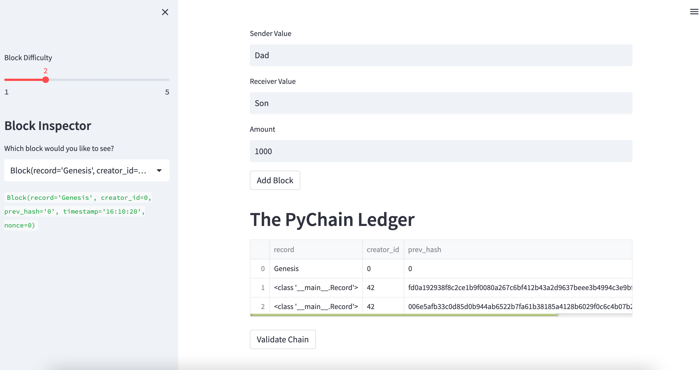
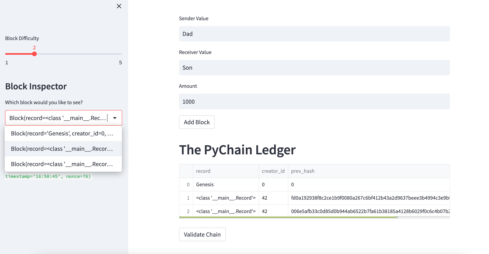
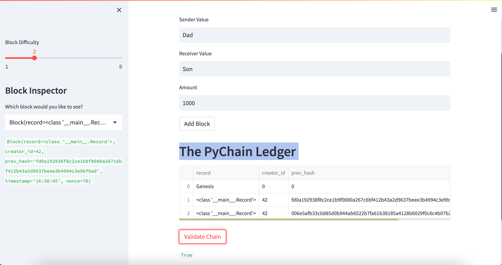

# Blockchain_Homework
# Blockchain_Homework

## Verifing  block contents and hashes in the Streamlit 
 
 
I was able to include Sender, receiver and amount input options in stream lit which allowed the block to be registered. 
 

 
 
 
 
Couple blocks were added to ascertain the chain 
 

 
 
 
 
I also tried out the validity button to ascertain that the chain was valid 
 

